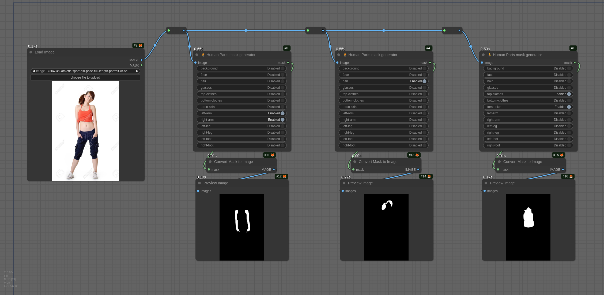
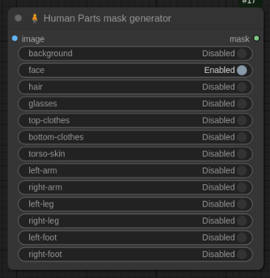

# Yet another custom node to detect human parts

Detect human parts using the DeepLabV3+ ResNet50 model from Keras-io. You can extract hair, arms, legs, and other parts
with ease and with small memory usage.

This node aims to detect human parts using the model created by
[Keras-io](https://huggingface.co/keras-io/deeplabv3p-resnet50). Their "[Space](https://huggingface.co/spaces/keras-io/Human-Part-Segmentation)" was impressive, and I wanted to use the
model.

Unfortunately, the model uses an old Keras version, and there were no PyTorch implementation.

So I decided to convert the model to [ONNX](https://onnx.ai/) format and to create my [HugginFace
repository](https://huggingface.co/Metal3d/deeplabv3p-resnet50-human) to share the model with the community.

> Fortunately, Keras provides the model with a CC1.0 license, thank you guys to allow us to use it without any
> restriction.

## Example

You can drag and drop the following image to try:



## DeepLabV3+ ResNet50 for Human

Actually, all the model I found was not trained to detect human parts, but to detect some objects or urban elements. The
Keras model is the only one I found that works!

## Installation

I strongly recommend to use ComfyUI-Manager to install the node. It will install the dependencies and the model.

> Note, as far as my repository isn't validated in the ComfyUI-Manager index, you must do the installation manually.

```bash
# ensure that you have activated the virtual environment before !!

# then...
cd /path/to/your/ComfyUI/custom_nodes
git clone https://github.com/metal3d/ComfyUI_Human_Parts.git
cd ComfyUI_Human_Parts
pip install -r requirements.txt
# or
python -m pip install -r requirements.txt
```

Then, restart ComfyUI and you may find the "HumanParts" node.


